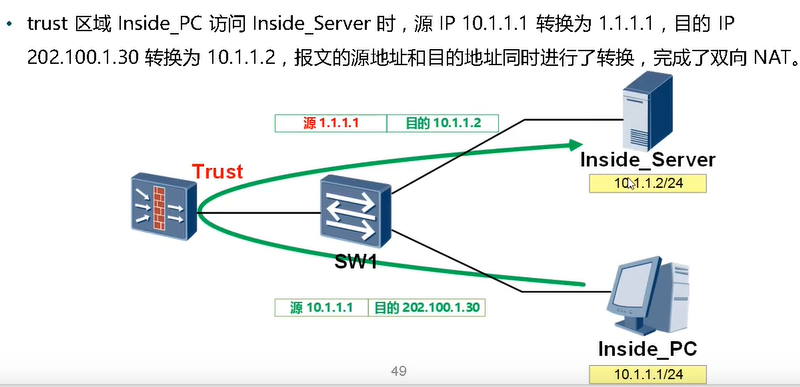
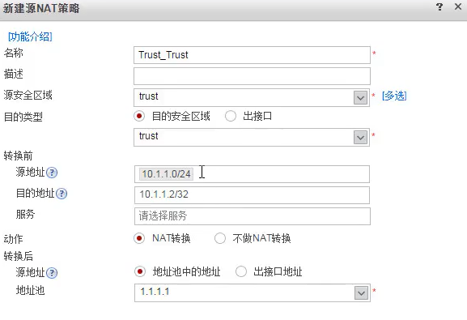
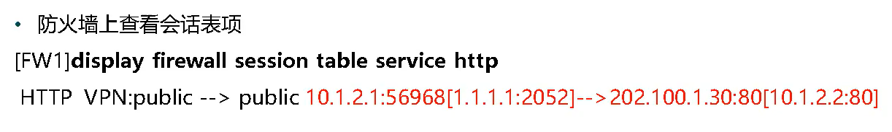

---

layout:     post   				    # 使用的布局（不需要改）
title:      华为防火墙NAT技术 				# 标题 
subtitle:   华为防火墙NAT技术 #副标题
date:       2020-08-04 				# 时间
author:     WD 						# 作者
header-img: img/post-bg-2015.jpg 	#这篇文章标题背景图片
catalog: true 						# 是否归档
tags:								#标签

- 网络技术

---


# 华为防火墙NAT技术

[toc]


## NAT的分类

| NAT 分类   | 实现方式               | 转换内容   | 是否转换端口 | 特点                                                         |
| ---------- | ---------------------- | ---------- | ------------ | :----------------------------------------------------------- |
| 源NAT      | 地址池方式             | 源IP地址   | 可选         | 采用地址池中的公网地址为私网用户进行地址转换，适用于大量私网用户访问Internet的场景 |
| 源NAT      | 出接口方式（easyIP）   | 源IP地址   | 是           | 内网主机直接借用公网接口的IP地址访问Internet，特别适用于公网接口IP地址是动态获取的情况 |
| 服务器映射 | 静态映射（NAT Server） | 目的IP地址 | 可选         | 公网地址和私网地址一对一进行映射，适用于公网用户访问私网内部服务器的场景 |
| 服务器映射 | 服务器负载均衡         | 目的IP地址 | 可选         | 适用于多个内网服务器提供相同的服务，对外虚拟成一个服务器，对用户的访问流量进行负载均衡的场景 |
| 目的NAT    | 目的NAT                | 目的IP地址 | 可选         | 适用于修改去往google dns的流量到国内dns的流量                |


## NAT基本概念: Server map

### Server-map 表项主要用于存放一种应映射关系，设备根据这种映射关系对报文的地址进行转换，并转发。

note：为未来的inbound 初始化的会话（并不为触发此条目的会话），提供特定的会话表项，用于处理此流量。

NAT生成Server-map的两种情况：

- 配置NAT Server成功后生成静态表项：
  1. 用于存放global地址和inside地址映射关系。
  2. 不配置 “no-reverse” 参数时，生成正反两个方向 Server-map。
  3. 配置“ no-reverse” 参数时，只生成正方向 Server-map。

配置NAT No-PAT后，流量触发建立Server-map表

- 用于存放私网IP地址与公网IP地址的映射关系

### 源NAT:  公用地址池

> 基于源IP地址做HASH，来选择一个地址池中的IP地址，一个源IP地址会固定使用那个选择的global地址。

### 源NAT的其他技术

- No-PAT：一对一IP地址转换

- NAPT：NAT转换时同事转换IP地址和端口号

  ​	note：nat地址pool内的IP地址

  - 直连会多一个arp的请求

  		- 非直连IP会造成环路，需要添加此地址的黑洞路由，ip route-s ip/mask null；

- Easy-IP： 使用接口上的公网IP地址对私网的IP地址进行转换。

- Smart-nat：同事支持No-PAT转换和NAPT转换。# 自动的预留一个IP地址做pat（仅高端设备）

  - 使用section 中的地址段进行一对一转换；
  - 使用smart-nopat地址进行napt转换

- 三元组NAT： 源IP、源端口、协议号， 为pat产生server-map，老化时间内保持转换不变（仅高端设备）

  - 支持万网主动访问； note：报障p2p应用
  - 动态端口对外一致性。


### 目的NAT和SLB

1. NAT Server: 

   NAT Server可以用来发布内网的服务器或者特定的服务

- nat server global 210.1.1.13 inside 10.1.10.100
- nat server protocol tcp global 210.1.1.14 80 inside 10.1.10.200 80


2. SLB 负载均衡

    - 按照实现配置的负载均衡算法，将访问同一个IP地址的用户流量分配到不通的服务器上
   - NGFW支持的负载算法
         - 简单轮询： 根据浏览的带宽均分到各个内网的服务器上，时每台服务器的负载相同
         - 加权轮询：根据每台内网服务器的权重来分配流量，时每台服务器的负载比例与权重比例先沟通。新增内网服务器时，重新计算权值比例，按新的权值比例来分配流量。
         - 源地址哈希： 根据流量的源地址进行hash计算，保证相同源地址的流量由同台内网服务器处理。
- NGFW的健康检查

- 配置举例


配置完nat后需要放行zone local 到  real-server的icmp流量，用于监控检查；

### 双向NAT

- 即转换源IP又转换目的地址

1. 多出口问题

```sequence
title: 多出口问题
client-->>FW:client traffic to FW
FW-->>Router: clinet trfaffic to Router
Router-->Server:Router forward trffic to Server
Note left of client:client_ip(global)|dest_ip(global)
Note right of client:client_ip(global)|dest_ip(global)
Note right of FW:client_ip(inside_ip)|dest_ip(inside_ip)
Note right of Router:client_ip(inside_ip)|dest_ip(inside_ip)
```


为了解决多个inbound流量到达同一服务器后，从哪个egress interface路由出去，相当于F5 的snat auto-map；

配置步骤

- [x] 配置源nat， 位于untrust域的client 的IP地址 any 转换为一个内网的IP地址

- [x] 配置服务器映射，global地址---->inside Server IP

2. 域内双向NAT配置

   - 由于私网client与私网Server被规划到同一个局域网中，位于同一个安全域内，当client通过公网访问服务器提供的服务时（服务器通过nat server对外提供服务），如果不处理会造成一服务器直接回包到client的私网地址，造成一部路由。

   

   **如下图**



配置举例：

1. 配置nat server 将inside_server 映射到公网global IP地址

2. 创建域内的nat策略

     


3. 查看会话表项

   


